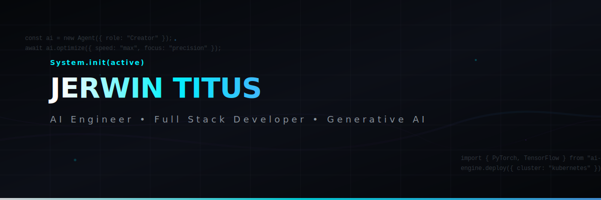
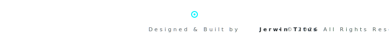

<!-- Animated Banner -->

 
 

<!-- Typing Animation -->

 

<!-- Profile Views -->

 
 

<!-- Social Badges -->

---

## 🚀 About Me

I am a passionate engineer pursuing a **B.Tech in Artificial Intelligence & Data Science**. I specialize in developing production-grade intelligent applications, microservices, and robust machine learning pipelines. My focus lies at the intersection of AI modeling and modern web scalability.

<table width="100%" style="border-collapse: collapse; border: none;">
  <tr>
    <td width="50%" style="border: none; padding: 10px; vertical-align: top;">
      <h3>🛠️ What I Build</h3>
      <ul>
        <li><strong>AI Applications</strong> • Semantic search and recommendation engines</li>
        <li><strong>LLM Projects</strong> • RAG systems, agents, and API integrations</li>
        <li><strong>Generative AI</strong> • Prompt engineering, embedding engineering</li>
        <li><strong>Computer Vision</strong> • OpenCV and OpenVINO deployments</li>
        <li><strong>Full Stack Apps</strong> • Fast, secure, and modern responsive interfaces</li>
        <li><strong>Open Source Projects</strong> • Contributing back to the community</li>
        <li><strong>Intelligent Automation</strong> • Workflows that eliminate repetitive tasks</li>
      </ul>
    </td>
    <td width="50%" style="border: none; padding: 10px; vertical-align: top;">
      <h3>🎯 Current Interests</h3>
      <ul>
        <li><strong>Agentic AI</strong> • Autonomous decision-making frameworks</li>
        <li><strong>Multi-Agent Systems</strong> • CrewAI, AutoGen, and LangGraph architectures</li>
        <li><strong>AI Engineering</strong> • Bridging model development and product delivery</li>
        <li><strong>LLM Fine-Tuning</strong> • LoRA, QLoRA, and custom dataset alignment</li>
        <li><strong>AI Infrastructure</strong> • Model quantization and hardware acceleration</li>
        <li><strong>Cloud Deployment</strong> • Containerized services via Docker & Kubernetes</li>
        <li><strong>System Design</strong> • High-concurrency event-driven patterns</li>
        <li><strong>Competitive Programming</strong> • Algorithmic optimization</li>
      </ul>
    </td>
  </tr>
</table>

---

## 💻 Tech Stack

### Languages

 

### Frontend & Backend

 

### AI & Deep Learning

 

### DevOps, Cloud & Tools

---

## 📂 Featured Projects

<table width="100%" style="border-collapse: collapse; border: none; margin: 20px 0;">
  <tr>
    <td width="50%" style="border: 1px solid #1f242e; border-radius: 8px; padding: 20px; background: #090b10; vertical-align: top; box-shadow: 0 4px 10px rgba(0,0,0,0.3);">
      <h3 style="margin-top: 0; color: #00f2fe;">HireIQ</h3>
      
AI-powered semantic candidate ranking system designed to parse resumes and evaluate candidates based on semantic job alignment.

      
Python • FastAPI • OpenAI • Qdrant • React

       
      <a href="https://github.com/JerwinTitus2006/HireIQ" style="display: inline-block; padding: 8px 16px; background: #121620; color: #ffffff; text-decoration: none; border-radius: 6px; font-size: 12px; border: 1px solid #30363d; font-weight: 600;">View Repository</a>
    </td>
    <td width="50%" style="border: 1px solid #1f242e; border-radius: 8px; padding: 20px; background: #090b10; vertical-align: top; box-shadow: 0 4px 10px rgba(0,0,0,0.3);">
      <h3 style="margin-top: 0; color: #00f2fe;">NorthStar</h3>
      
An intelligent market analytics and competitor intelligence platform transforming unstructured market reports into real-time visual insights.

      
TypeScript • Next.js • TailwindCSS • LangChain • PostgreSQL

       
      <a href="https://github.com/JerwinTitus2006/NorthStar" style="display: inline-block; padding: 8px 16px; background: #121620; color: #ffffff; text-decoration: none; border-radius: 6px; font-size: 12px; border: 1px solid #30363d; font-weight: 600;">View Repository</a>
    </td>
  </tr>
  <tr>
    <td width="50%" style="border: 1px solid #1f242e; border-radius: 8px; padding: 20px; background: #090b10; vertical-align: top; box-shadow: 0 4px 10px rgba(0,0,0,0.3);">
      <h3 style="margin-top: 0; color: #00f2fe;">Wonderly</h3>
      
A career guidance ecosystem utilizing deep personality and skill analysis to provide highly tailored developmental roadmaps.

      
React • Express • Node.js • TensorFlow.js • MongoDB

       
      <a href="https://github.com/JerwinTitus2006/Wonderly" style="display: inline-block; padding: 8px 16px; background: #121620; color: #ffffff; text-decoration: none; border-radius: 6px; font-size: 12px; border: 1px solid #30363d; font-weight: 600;">View Repository</a>
    </td>
    <td width="50%" style="border: 1px solid #1f242e; border-radius: 8px; padding: 20px; background: #090b10; vertical-align: top; box-shadow: 0 4px 10px rgba(0,0,0,0.3);">
      <h3 style="margin-top: 0; color: #00f2fe;">AI Personal Tutor</h3>
      
Adaptive e-learning portal using real-time progress assessment to adjust the difficulty and explanation depth of technical topics.

      
Python • Flask • Llama-Index • PyTorch • SQLite

       
      <a href="https://github.com/JerwinTitus2006/AI-Personal-Tutor" style="display: inline-block; padding: 8px 16px; background: #121620; color: #ffffff; text-decoration: none; border-radius: 6px; font-size: 12px; border: 1px solid #30363d; font-weight: 600;">View Repository</a>
    </td>
  </tr>
  <tr>
    <td width="50%" style="border: 1px solid #1f242e; border-radius: 8px; padding: 20px; background: #090b10; vertical-align: top; box-shadow: 0 4px 10px rgba(0,0,0,0.3);">
      <h3 style="margin-top: 0; color: #00f2fe;">SafeJourney</h3>
      
An enterprise-grade women safety platform leveraging IoT data streams and real-time audio distress signal processing.

      
Kotlin • Node.js • Socket.io • GCP Maps API • Firebase

       
      <a href="https://github.com/JerwinTitus2006/SafeJourney" style="display: inline-block; padding: 8px 16px; background: #121620; color: #ffffff; text-decoration: none; border-radius: 6px; font-size: 12px; border: 1px solid #30363d; font-weight: 600;">View Repository</a>
    </td>
    <td width="50%" style="border: 1px solid #1f242e; border-radius: 8px; padding: 20px; background: #090b10; vertical-align: top; box-shadow: 0 4px 10px rgba(0,0,0,0.3);">
      <h3 style="margin-top: 0; color: #00f2fe;">Chess AI</h3>
      
Computer vision assistant parsing physical chessboard layouts using cameras and calculating optimal next moves via minimax/neural engine.

      
Python • OpenCV • Stockfish API • PyTorch

       
      <a href="https://github.com/JerwinTitus2006/Chess-AI" style="display: inline-block; padding: 8px 16px; background: #121620; color: #ffffff; text-decoration: none; border-radius: 6px; font-size: 12px; border: 1px solid #30363d; font-weight: 600;">View Repository</a>
    </td>
  </tr>
</table>

---

## 📊 Git Analytics & Insights

<table border="0" style="border: none;">
  <tr style="border: none;">
    <td style="border: none; padding: 5px;">
      
    </td>
    <td style="border: none; padding: 5px;">
      
    </td>
  </tr>
</table>

 

<table border="0" style="border: none;">
  <tr style="border: none;">
    <td style="border: none; padding: 5px; vertical-align: top;">
      
    </td>
    <td style="border: none; padding: 5px; vertical-align: top;">
      
    </td>
  </tr>
</table>

 

### Coding Activity Graph

---

## 🏆 LeetCode Profile

---

## 🏅 Credentials & Badges

<!-- Holopin Badges -->

---

## 🎮 Contribution Pac-Man

<!-- Pac-Man Contribution Graph -->
<picture>
  <source media="(prefers-color-scheme: dark)" srcset="https://raw.githubusercontent.com/JerwinTitus2006/JerwinTitus2006/output/pacman-contribution-graph-dark.svg">
  <source media="(prefers-color-scheme: light)" srcset="https://raw.githubusercontent.com/JerwinTitus2006/JerwinTitus2006/output/pacman-contribution-graph.svg">
  
</picture>

---

## 🎵 Spotify Currently Playing

<!-- START_SECTION:spotify -->

  <a href="https://open.spotify.com/track/630sXRhIcfwr2e4RdNtjKN" target="_blank" rel="noopener noreferrer">
    
    

      🔊 NOW PLAYING 
      Rewrite the Stars 
      by Zac Efron, Zendaya
    

  </a>

<!-- END_SECTION:spotify -->

---

## ✍️ Latest Blog Articles

<!-- START_SECTION:blog-posts -->
- 🚀 [From Overwhelmed to Understanding: How Building My Own Neural Network Made Machine Learning Click](https://medium.com/@titusjerwin/from-overwhelmed-to-understanding-how-building-my-own-neural-network-made-machine-learning-click-bdc4cf2dbce5)
<!-- END_SECTION:blog-posts -->

---

## ⚡ Recent GitHub Activity

<!-- START_SECTION:activity -->
*My latest public commits, pull requests, and activity on GitHub will appear here automatically.*
<!-- END_SECTION:activity -->

---

## 💡 Developer Musings

<!-- START_SECTION:quote -->

> *"I expect disappointment, so I can never be disappointed 🙃"*
>
> — **MJ (Spider-Man: No Way Home)**
<!-- END_SECTION:quote -->

---

## 🤝 Let's Connect

| Channel | Contact Point |
| :--- | :--- |
| **Email** | [jerwintitusofficial@gmail.com](mailto:jerwintitusofficial@gmail.com) |
| **LinkedIn** | [linkedin.com/in/jerwintitus](https://linkedin.com/in/jerwintitus) |
| **Portfolio** | [jerwintitus.tech](https://jerwintitus.tech) |

 

### Support My Work

 
 

<!-- Animated Footer -->

